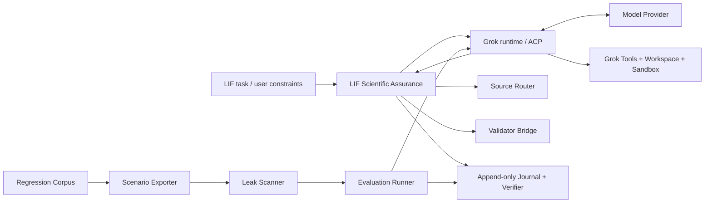

# Grok Build 架构适配矩阵 v0.1

状态：历史适配审计；当前实现路线已由
[`UPSTREAM_FIRST_INTEGRATION_v0.1.md`](UPSTREAM_FIRST_INTEGRATION_v0.1.md) 收缩为 upstream-first，产品与术语
定位见 [`PRODUCT_POSITIONING_AND_REFERENCE_STRATEGY_v0.1.md`](PRODUCT_POSITIONING_AND_REFERENCE_STRATEGY_v0.1.md)。

2026-07-30 follow-up alignment：Grok `0.2.112` 已提升为默认 lock，Runtime-First
路线已把 Grok ACP/workflow/subagent/permission/tool registry 作为后续主嫁接面。
本文件第 3 节的旧 V0 矩阵已按该裁决更新：headless 保留为 narrow smoke，
ACP 优先用于真实 prompt/tool observability；两个检索子代理映射到 Grok-compatible
profile/workflow，不再作为本地 scheduler 扩展。

参考快照：`xai-org/grok-build` `main`，检查日期 2026-07-19，仓库 `SOURCE_REV` 为 `f9736c7b86f8e1c0e99e20ebbbd1195cd0c147e3`。

上游状态注记：2026-07-21 复查时 build 仓库提交为 `a881e6703f46b01d8c7d4a5437683546df30449d`，`SOURCE_REV` 为 `c5c4ce03436b4bb2cec43d3feaa27dee0109bf37`。两者不是同一个 Git 历史，不能互相做 compare。当前集成基线与职责集合记录在 [`../upstream/grok-build.lock.json`](../upstream/grok-build.lock.json)。

当前上游 README 同时声明 macOS/Linux 是受支持 build host，Windows build 为 best-effort 且未在该源码树测试。本项目的实际运行面包含 Windows，因此不能继承上游测试缺口；本仓库 CI 必须保留 Windows runner，后续 Rust 控制面也需独立 Windows process/sandbox probes。

当前资源策略不是 fork、完整 source build 或迁移上游 crate，而是优先采用 Windows 预编译 Grok。[`WINDOWS_RUNTIME_CONTRACT_v0.1.md`](../存档/architecture/runtime-spikes/WINDOWS_RUNTIME_CONTRACT_v0.1.md) 的 Python spike 只保留作进程控制 conformance fixture；除非窄 probe 证明上游有不可绕过的缺口，否则不移植 Rust runtime。

## 1. 结论

通用 Agent CLI 的功能面无需大量自创。Grok Build 已提供 TUI、headless、ACP、session persistence、工具、
workspace、MCP、skills、plugins、hooks、permissions、sandbox、memory、subagents、worktrees 和监控等完整
参考面。我们的差异不应表现为“更多按钮”，而应集中在 **LIF 专项科学保障层**：来源路由、任务契约、
证据/claim 状态、validator、场景隔离、泄漏门禁、全局进度回看和回归评测。这里的“保障”约束 Agent
如何服务 LIF 研究，不表示 LIF/FEP 理论参与 Agent 控制算法。

## 2. 官方结构事实

官方 README 将系统分成：

- `xai-grok-pager-bin`：composition root；
- `xai-grok-pager`：TUI；
- `xai-grok-shell`：Agent runtime 与 leader/stdio/headless 入口；
- `xai-grok-tools`：terminal、file edit、search 等工具；
- `xai-grok-workspace`：文件系统、VCS、执行和 checkpoint；
- 其余独立 crate：config、MCP、sandbox、memory、hooks、协议和支持库。

官方文档还确认：

- headless 支持结构化 JSON/streaming JSON；
- ACP 使用 JSON-RPC/stdin/stdout，暴露 session、tool、permission 和 streaming update；
- `updates.jsonl` 是 session restore 的 authoritative conversation log；
- permission、hook 与 OS sandbox 是分层控制；
- project rules 使用目录层级 precedence；
- sandbox 默认关闭，内建 strict/read-only 仍存在平台差异；
- `PreToolUse` 可阻断，但 hook crash、timeout 或 malformed output 默认 fail-open。

这些是参考实现事实；不代表其默认值适合本项目。

## 3. 适配矩阵

| Grok Build 能力 | 本项目 V0 决策 | 适配方式 |
|---|---|---|
| composition root / runtime / tools / workspace 分离 | 采用 | 保持内核、模型 adapter、工具与 UI 解耦 |
| headless JSON | 保留为 narrow smoke | 适合 `version-smoke`、一次性结构化 smoke 和候选 gate；不作为真实 prompt/tool observability 主路径 |
| ACP stdio | 优先嫁接 | 真实 prompt/tool 路径优先使用 ACP/等价 runtime event 面，以观察 session、tool、permission 和 streaming update |
| session persistence / authoritative event log | 采用 | append-only journal + immutable run manifest |
| permission rules + sandbox | 采用并收紧 | guarded/evaluation 默认 deny；权限许可不能改变证据资格 |
| hooks | 限制采用 | 只做通知、观察和非关键扩展；证据门禁与 leak gate 不放进 fail-open hook |
| project rules precedence | 部分采用 | 文件层级可控制工程偏好，但不能覆盖 source-of-truth、oracle isolation 或 claim gate |
| tools / MCP | 采用 adapter 思路 | 工具能力声明、side-effect 分类和权限契约必须模型无关 |
| skills / plugins | 延后 | 协议稳定后再提供；不能动态绕过 gate registry |
| memory | 普通会话可选，评测关闭 | 历史案例不作为默认 session memory；evaluation/holdout 强制 disabled |
| subagents / personas | 限定采用 | 只承载两个检索子代理的 Grok-compatible profile/workflow 映射；不新增本地 multi-agent scheduler |
| worktrees / rewind | 延后采用 | 对实现任务有价值，但不是证据内核前置条件 |
| TUI / dashboard / theming | 采用状态投影 | 本仓库 TUI 作为 assurance workbench 消费 normalized Grok runtime/workflow/subagent/permission events，不拥有执行调度 |
| remote relay / cloud service | 不采用 | 保持 local-first；用户确认当前移动端设计已覆盖远程使用，详见 ADR-0002 |
| external telemetry | 默认不采用 | 本地审计日志优先；任何外发必须显式 opt-in 和脱敏 |
| vendor auth / update channel | 不采用 | 模型 provider 由 adapter 处理 |

## 4. LIF 专项科学保障层

Grok Build 的通用 runtime 之外，本项目仍需以下不可省略的能力。旧研究工作区来源只在具体 claim-bearing
任务中按需读取，不成为这些组件的启动依赖：

1. `SourceRouter`：按 INDEX → env/current MAP → R/raw artifact/code → self-check 路由。
2. `TaskContract`：固定 MUST、MUST NOT、SOURCE OF TRUTH、ACCEPTANCE。
3. `EvidenceKernel`：维护 action/evidence/claim 三套状态与 reason-code gate。
4. `ValidatorBridge`：运行现有 Python validator，保留输入、输出、版本和局限。
5. `ClaimBoundary`：区分 measured、direct comparison、bridge hypothesis 与 promotion eligibility。
6. `ScenarioExporter`：从 corpus 生成只有可见事实的匿名场景包。
7. `LeakScanner`：机械检查加独立语义审阅；evaluation/holdout fail-closed。
8. `EvaluationRunner`：冻结模型、prompt、工具、预算、digest 和 append-only journal。
9. `CaseRetrievalGuard`：blind-first；历史案例检索晚于 precommitment。
10. `ClaimRegistrySync`：默认只提出 patch，不自动修改 MAP/INDEX。
11. `ProviderAdapters`：对 DeepSeek 等 provider 的 thinking、tool transcript、stream keep-alive、模型解析和能力降级做显式 preflight；provider 兼容层不得静默改写执行语义。

## 5. 建议模块边界

`ScenarioExporter`、`LeakScanner` 和 `EvaluationRunner` 是科学保障组件，不是 prompt 技巧，也不应实现为普通
fail-open hook。

## 6. Rust / Python 边界

- Rust 候选：composition root、状态机、permission/sandbox broker、journal、digest、export gate、runner 和 CLI/stdio。
- Python 保留：FEP/LIF 实验、分析、现有 validator 和快速领域探针。
- 两者使用版本化 JSON/JSONL 或进程接口；V0 不使用 Python FFI。

Rust 的价值在此处来自显式类型、所有权边界、单二进制分发和并发/进程控制，不来自“X 使用了 Rust”这一品牌事实。

## 7. 不直接继承的默认值

- 不继承 sandbox-off 默认值；guarded/evaluation 必须显式选择隔离 profile。
- 不把 fail-open hook 当作科学或评测硬门。
- 不允许 `always approve`、深层 AGENTS 或 plugin 改写 oracle isolation、source-of-truth 和 claim eligibility。
- 不把 session memory、项目历史或 reviewer fixture 注入 evaluation。
- 不把能执行工具等同于工具输出可成为证据。

## 8. 参考来源

- [Grok Build repository and crate layout](https://github.com/xai-org/grok-build)
- [Pinned monorepo source revision](https://github.com/xai-org/grok-build/blob/main/SOURCE_REV)
- [Headless mode](https://github.com/xai-org/grok-build/blob/main/crates/codegen/xai-grok-pager/docs/user-guide/14-headless-mode.md)
- [ACP agent mode](https://github.com/xai-org/grok-build/blob/main/crates/codegen/xai-grok-pager/docs/user-guide/15-agent-mode.md)
- [Sessions](https://github.com/xai-org/grok-build/blob/main/crates/codegen/xai-grok-pager/docs/user-guide/17-sessions.md)
- [Hooks](https://github.com/xai-org/grok-build/blob/main/crates/codegen/xai-grok-pager/docs/user-guide/10-hooks.md)
- [Sandbox](https://github.com/xai-org/grok-build/blob/main/crates/codegen/xai-grok-pager/docs/user-guide/18-sandbox.md)
- [Permissions and safety](https://github.com/xai-org/grok-build/blob/main/crates/codegen/xai-grok-pager/docs/user-guide/22-permissions-and-safety.md)
