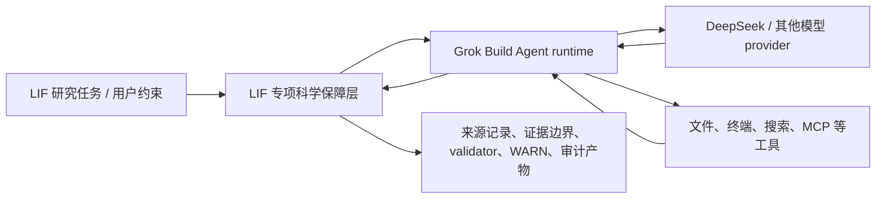

# 产品定位与多源借鉴策略 v0.1

状态：2026-07-23 生效；记录产品定位与术语边界，不修改 protocol v0.1、reason code、gate、claim、
evaluation 或 oracle-isolation 语义。

## 1. 决策

本项目是**基于 Grok Build 深度特化的 LIF 研究 Agent CLI**。当前没有强制更换底座的必要，也不建设可在多个
通用 Agent runtime 间任意切换的产品框架。

正式定位为：

1. **Grok Build 是唯一产品底座和通用 Agent runtime owner**；
2. **LIF 专项科学保障层是本项目的核心差异**；
3. Codex CLI、Gemini CLI、Claude Code、Goose 与 OpenCode 是分工明确的设计参考，不是并列 runtime；
4. Grok 上游版本通过 observed baseline / current candidate / promotion gate 管理，不追逐每个发布，也不永久
   锁死在旧版本；
5. 只有 Grok 出现经过 conformance 证明且无法通过窄 adapter、wrapper 或上游修复处理的关键缺口时，才重新评估
   底座迁移。

“开源项目更多”本身不是迁移理由。已经完成的 Grok ACP、DeepSeek continuity、Windows 进程、事件桥和 verifier
工作属于可复现实证；更换底座必须用同一套门禁证明收益大于重新验证成本。

## 2. 产品结构

### 2.1 Grok Build 负责

- TUI、headless 与 ACP；
- model/tool loop、session、compaction 与 background task；
- 通用工具、workspace、permission、sandbox、skills、plugins、hooks 与 MCP；
- 上游能够直接承担的通用 Agent 产品能力。

### 2.2 LIF 专项科学保障层负责

- 要求来源先行、Ask-Don't-Guess，并记录实际读取来源；
- 固定 task contract、用户约束、验收条件和 source of truth；
- 区分 action、observed fact、evidence、direct comparison、bridge hypothesis 与可提升 claim；
- 记录模型、工具、文件变化、permission、取消、terminal 与缺失观测；
- 运行 validator 并保留输入、输出、版本和局限，不把机械 PASS 提升为科学证明；
- 维护 oracle isolation、scenario export、leak scan 和 evaluation 边界；
- 用 Global Progress Sentinel 对单方向过推进、遗漏验收和 verification debt 产生可追溯 WARN；
- 对 DeepSeek thinking/tool transcript、模型解析和能力降级做专项 conformance；
- 在 Windows 上核验进程树、取消、超时、凭据和真实副作用 receipt。

这层可以使用 launcher、adapter、wrapper、append-only journal、独立 verifier 和少量 hard gate 实现；“保障层”
描述的是职责，不要求所有组件位于同一进程、语言或二进制。

## 3. 术语边界

后续说明性文档统一优先使用 **LIF 专项科学保障层**（英文可写
`LIF-specific scientific assurance layer`）。

以下旧称只在精确描述实现形态时使用：

- `sidecar`：某个保障组件实际运行在 Grok 进程之外；
- `launcher`：负责启动前冻结、版本选择、最小环境和进程监督；
- `adapter`：处理 DeepSeek 等 provider 的协议差异；
- `control plane`：仅指确定性的工程控制或 gate，不指 LIF/FEP 理论控制 Agent。

“LIF 专项科学保障层”**不表示**：

- 把 LIF/FEP 理论实现为 Agent 的控制算法；
- 让旧研究工作区的 INDEX/MAP/self-check 成为 CLI 启动依赖；
- 让 Agent 自动修改 LIF claim registry；
- 让 trace、validator、回滚或多数模型意见保证输出必然正确；
- 让本项目演化成与 LIF 研究目标无关的通用多 runtime Agent 平台。

普通 CLI 工程工作只使用本仓库文件。具体 LIF claim-bearing 任务需要旧研究来源时，才跨目录读取原文件并登记
绝对路径、内容 digest 和本次使用边界；本仓库摘要不能替代研究来源。

## 4. 多源借鉴矩阵

| 产品 | 当前角色 | 重点借鉴 | 不做什么 |
|---|---|---|---|
| Grok Build | 唯一底座 | ACP、session、tool/permission/sandbox、background task、custom model、Windows binary | 不追每个版本；不因公开快照更新而无门禁合并 |
| Codex CLI | 首要审计与执行参考 | typed event、rollout/replay、approval、sandbox、配置锁与进程边界 | 不迁入第二套 runtime 或 OpenAI 专属产品面 |
| Gemini CLI | policy 与恢复参考 | policy engine、trusted folder、checkpoint、headless stream、skills/hooks/extensions | 不在其产品迁移期改作本项目底座 |
| Claude Code | 行为与扩展 UX 参考 | `CLAUDE.md`、skills、hooks、plugins、subagents、permission UX | 核心 CLI 未以开源许可证发布，不作为可 fork 底座或源码移植来源 |
| Goose | provider 与定制发行参考 | 多 provider、custom distribution、ACP、MCP、Windows/Rust 可移植性 | 不引入平行 provider/runtime 栈 |
| OpenCode | provider 与 snapshot 参考 | provider abstraction、client/server、snapshot/revert、permission event | 不因其开放性改写现有 Grok 集成 |

截至 2026-07-23：

- Gemini CLI 仓库为 Apache-2.0 开源并接受贡献；Google 已宣布将个人终端产品重心迁往 Antigravity CLI，
  因此当前把 Gemini CLI 视为成熟设计来源，而不是新的长期底座；
- Claude Code 有公开 GitHub 仓库和若干开源周边项目，但官方核心 CLI 的使用受商业/消费者条款约束，
  不应把“公开仓库”误记为“核心 CLI 已开源”。

## 5. 未来想法的隔离

“让 LIF/FEP 原理参与 Agent 的探索、计划、注意分配、置信度更新或控制”是一个不同的研究想法，暂记为
**LIF-informed agent architecture（deferred concept）**。

在另行形成研究问题、可证伪假设、对照基线、风险边界和独立评测前，该想法：

- 不进入当前产品定位；
- 不改变 Grok runtime 所有权；
- 不改变现有协议、gate 或 claim 语义；
- 不以“LIF 专项科学保障层”的名义静默实现。

## 6. 重新评估底座的触发条件

只有至少出现一项经可复现 fixture 证明的条件，才开启底座迁移 ADR：

1. Grok 无法保持目标 provider 的必要协议语义，且窄 adapter/上游修复不可行；
2. Windows 进程、取消或安全边界存在不可接受且无法外部收束的缺口；
3. ACP/session 观测面无法支撑最低审计完整性，并且无法通过明确标注的 cross-check 补足；
4. 上游分发、许可或可获得性发生实质变化；
5. 另一候选在同一套 LIF conformance/evaluation 下证明有显著净收益。

频繁发布、其他产品 star 数、UI 新功能或“也是开源”都不是单独触发条件。

## 7. 官方来源

- [Grok Build repository](https://github.com/xai-org/grok-build)
- [Grok Build contribution policy](https://github.com/xai-org/grok-build/blob/main/CONTRIBUTING.md)
- [OpenAI Codex CLI repository](https://github.com/openai/codex)
- [Gemini CLI repository and Apache-2.0 license](https://github.com/google-gemini/gemini-cli)
- [Google: transitioning Gemini CLI to Antigravity CLI](https://developers.googleblog.com/en/an-important-update-transitioning-gemini-cli-to-antigravity-cli/)
- [Claude Code repository](https://github.com/anthropics/claude-code)
- [Claude Code legal and compliance](https://code.claude.com/docs/en/legal-and-compliance)
- [Goose repository](https://github.com/aaif-goose/goose)
- [OpenCode repository](https://github.com/anomalyco/opencode)
