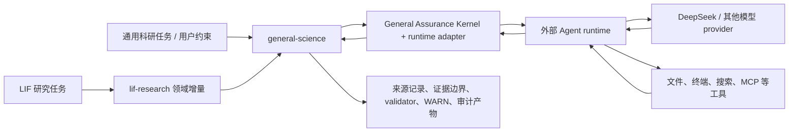

> **pre-ADR-0010 冻结状态头（2026-09-24，审查修复批）**：本文件属 pre-ADR-0010 时期冻结 fixture／development-only spike——**非 `current`、仅历史基线**，不作为实现依据；当前设计权威＝[`ADR-0010`](../adr/ADR-0010-fusion-runtime-and-agent-architecture.md)（本状态头为其 §7.2 归档规则的**就地冻结**轻量替代，不移档不改正文，2026-09-24 批登记）。

# 产品定位与多源借鉴策略 v0.1

状态：2026-07-25 依 ADR-0003/ADR-0004 修订；记录产品定位与术语边界，不修改 protocol v0.1、reason code、
gate、claim、evaluation 或 oracle-isolation 语义。

## 1. 决策

本项目是 **runtime-neutral、LIF-first 的通用科学保障层**。它通过窄 adapter 接入通过 capability gate
的外部 Agent runtime，但不自建或同时维护多个通用 runtime 产品。LIF 是首个领域 profile，
不是通用科学能力的命名空间或测试语料来源。

正式定位为：

1. **Grok Build 是当前证据最完整的 reference runtime，不是默认、强制或唯一底座**；
2. **`general-science` 通用科学保障 profile 是核心差异，`lif-research` 只添加领域增量**；
3. profile 只要求 capability、隔离和验收门禁，不要求 runtime family；
4. Grok、Codex CLI、Gemini CLI、Claude Code、Goose 与 OpenCode 均可作为分工明确的设计参考；
5. 任一实际 runtime 必须经自己的 adapter、observed fixture 和独立 verifier 通过同类门禁；
6. reference 身份、开源状态或用户偏好都不能单独授予 runtime acceptance。

已经完成的 Grok ACP、DeepSeek continuity、Windows 进程、事件桥和 verifier 工作仍属于可复现实证，
但只证明 Grok adapter 的已观测边界。其他 runtime 不能继承这些 PASS，Grok 也不能凭 reference 身份跳过
未来新增的通用 hard gate。

## 2. 产品结构

### 2.1 选中的外部 runtime 负责

- runtime 自身支持的 TUI、headless 与结构化控制接口（支持 ACP 时使用 ACP）；
- model/tool loop、session、compaction 与 background task；
- 通用工具、workspace、permission、sandbox、skills、plugins、hooks 与 MCP；
- 该 runtime 能够直接承担的通用 Agent 产品能力。

Grok Build 当前用于 reference adapter 和 observed baseline；上述职责不构成对 Grok 的全局绑定。

### 2.2 `general-science` 负责

- 要求来源先行、Ask-Don't-Guess，并记录实际读取来源；
- 固定 task contract、用户约束、验收条件和 source of truth；
- 区分 action、observed fact、evidence、direct comparison、bridge hypothesis 与可提升 claim；
- 记录模型、工具、文件变化、permission、取消、terminal 与缺失观测；
- 运行 validator 并保留输入、输出、版本和局限，不把机械 PASS 提升为科学证明；
- 维护 oracle isolation、scenario export、leak scan 和 evaluation 边界；
- 用 Global Progress Sentinel 对单方向过推进、遗漏验收和 verification debt 产生可追溯 WARN；
- 建立不依赖项目文件名的多来源追踪、研究生命周期和 claim/evidence 边界。

这层可以使用 launcher、adapter、wrapper、append-only journal、独立 verifier 和少量 hard gate 实现；“保障层”
描述的是职责，不要求所有组件位于同一进程、语言或二进制。

### 2.3 `lif-research` 只添加

- LIF_CURRENT_INDEX → 当前环境/MAP → R/JSON/log/code → self-check 的当前来源路由；
- claim registry prior-existence、撤回/降级/改名链检查；
- LIF 实验与结果 schema 的领域 validator；
- 已有 Grok/DeepSeek/Windows 专项 conformance 入口。

LIF 内部任务不得用于通用复杂测试、阈值校准或 holdout。

## 3. 术语边界

后续说明性文档使用 **通用科学保障层**（`general scientific assurance layer`）描述共同能力，
使用 **LIF 领域 profile** 描述 INDEX/MAP/R 路由和领域 validator 增量。

以下旧称只在精确描述实现形态时使用：

- `sidecar`：某个保障组件实际运行在 Grok 进程之外；
- `launcher`：负责启动前冻结、版本选择、最小环境和进程监督；
- `adapter`：处理 DeepSeek 等 provider 的协议差异；
- `control plane`：仅指确定性的工程控制或 gate，不指 LIF/FEP 理论控制 Agent。

“通用科学保障层 + LIF 领域 profile”**不表示**：

- 把 LIF/FEP 理论实现为 Agent 的控制算法；
- 让旧研究工作区的 INDEX/MAP/self-check 成为 CLI 启动依赖；
- 让 Agent 自动修改 LIF claim registry；
- 让 trace、validator、回滚或多数模型意见保证输出必然正确；
- 让本项目演化成与 LIF 研究目标无关的通用多 runtime Agent 平台；
- 要求所有任务必须通过 Grok 或任何其他单一 runtime 执行。

普通 CLI 工程工作只使用本仓库文件。具体 LIF claim-bearing 任务需要旧研究来源时，才跨目录读取原文件并登记
绝对路径、内容 digest 和本次使用边界；本仓库摘要不能替代研究来源。

## 4. 多源借鉴矩阵

| 产品 | 当前角色 | 重点借鉴 | 不做什么 |
|---|---|---|---|
| Grok Build | 当前 reference runtime | ACP、session、tool/permission/sandbox、background task、custom model、Windows binary | reference 身份不授予 acceptance；不追每个版本 |
| Codex CLI | 首要审计与执行参考 | typed event、rollout/replay、approval、sandbox、配置锁与进程边界 | 不迁入第二套 runtime 或 OpenAI 专属产品面 |
| Gemini CLI | policy 与恢复参考 | policy engine、trusted folder、checkpoint、headless stream、skills/hooks/extensions | 不在其产品迁移期改作本项目底座 |
| Claude Code | 行为与扩展 UX 参考 | `CLAUDE.md`、skills、hooks、plugins、subagents、permission UX | 核心 CLI 未以开源许可证发布，不作为可 fork 底座或源码移植来源 |
| Goose | provider 与定制发行参考 | 多 provider、custom distribution、ACP、MCP、Windows/Rust 可移植性 | 不引入平行 provider/runtime 栈 |
| OpenCode | provider 与 snapshot 参考 | provider abstraction、client/server、snapshot/revert、permission event | 不因其开放性改写现有 Grok 集成 |

截至 2026-07-23：

- Gemini CLI 仓库为 Apache-2.0 开源并接受贡献；Google 已宣布将个人终端产品重心迁往 Antigravity CLI，
  因此当前把 Gemini CLI 视为成熟设计来源，而不是新的长期底座；
- Claude Code 有公开 GitHub 仓库和若干开源周边项目，但官方核心 CLI 的使用受商业/消费者条款约束，
  不应把“公开仓库”误记为“核心 CLI 已开源”。

## 5. 未来想法的隔离

“让 LIF/FEP 原理参与 Agent 的探索、计划、注意分配、置信度更新或控制”是一个不同的研究想法，暂记为
**LIF-informed agent architecture（deferred concept）**。

在另行形成研究问题、可证伪假设、对照基线、风险边界和独立评测前，该想法：

- 不进入当前产品定位；
- 不改变 runtime-neutral 所有权和 capability-gated 选择；
- 不改变现有协议、gate 或 claim 语义；
- 不以 `general-science` 或 `lif-research` 的名义静默实现。

## 6. 接纳或替换 runtime adapter 的触发条件

新增或替换实际 runtime adapter 必须由可复现 fixture 驱动；以下条件可触发比较，但不自动授予 acceptance：

1. 当前 runtime 无法保持目标 provider 的必要协议语义，且窄 adapter/上游修复不可行；
2. Windows 进程、取消或安全边界存在不可接受且无法外部收束的缺口；
3. ACP/session 观测面无法支撑最低审计完整性，并且无法通过明确标注的 cross-check 补足；
4. 上游分发、许可或可获得性发生实质变化；
5. 另一候选在同一套 LIF conformance/evaluation 下证明有显著净收益。

频繁发布、产品 star 数、UI 新功能、“也是开源”或“当前是 reference”都不是单独的选择条件。

runtime-neutral 的正式所有权与禁止强绑规则见
[`ADR-0003`](../adr/ADR-0003-runtime-neutral-assurance-kernel.md)；profile 分层与测试隔离见
[`ADR-0004`](../adr/ADR-0004-general-science-profile-layering.md)。

## 7. 官方来源

- [Grok Build repository](https://github.com/xai-org/grok-build)
- [Grok Build contribution policy](https://github.com/xai-org/grok-build/blob/main/CONTRIBUTING.md)
- [OpenAI Codex CLI repository](https://github.com/openai/codex)
- [Gemini CLI repository and Apache-2.0 license](https://github.com/google-gemini/gemini-cli)
- [Google: transitioning Gemini CLI to Antigravity CLI](https://developers.googleblog.com/en/an-important-update-transitioning-gemini-cli-to-antigravity-cli/)
- [Claude Code repository](https://github.com/anthropics/claude-code)
- [Claude Code legal and compliance](https://code.claude.com/docs/en/legal-and-compliance)
- [Goose repository](https://github.com/aaif-goose/goose)
- [OpenCode repository](https://github.com/anomalyco/opencode)
