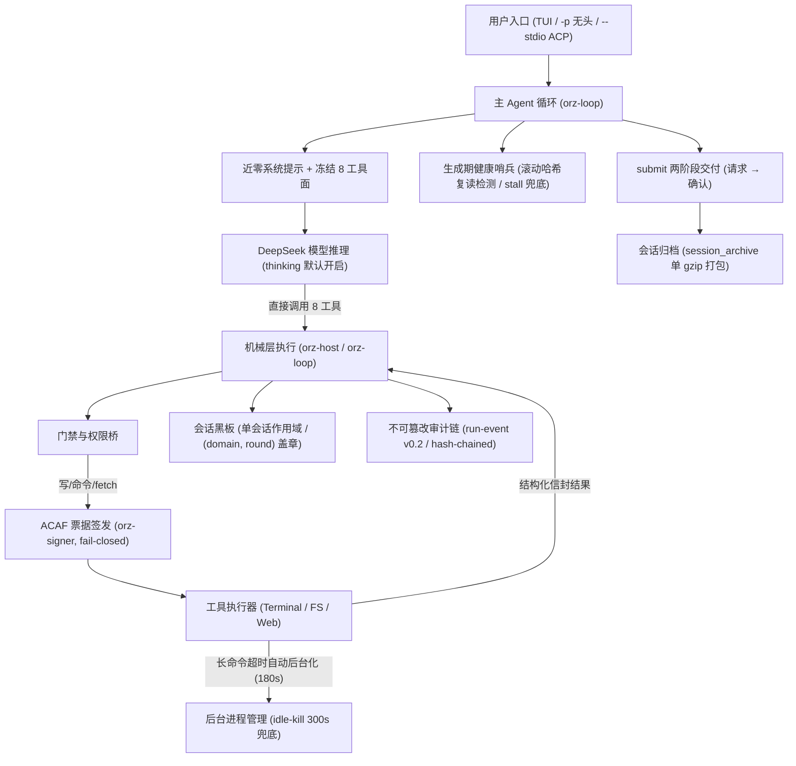

# 当前生产架构投影（Current Architecture Projection）

> **状态**：`current-design`（投影文件，不独立产生新设计）；**更新日期**：2026-09-04
> **设计权威**：[`adr/ADR-0010-fusion-runtime-and-agent-architecture.md`](../../adr/ADR-0010-fusion-runtime-and-agent-architecture.md)（含 §14.52 会话黑板、§14.54 压缩快照、§14.55 工具执行层改革）
> **治理边界**：本文件为 ADR-0010 与当前真实代码运行链路的直映投影，不独立产生新设计。

---

## 1. 真实产品面运行拓扑

系统当前实际运行的主链路为**“单主 Agent 推动 + 8 工具直接执行 + 机械会话黑板 + 离线审计哈希链”**。

---

## 2. 核心架构要素与真实边界

### 2.1 Agent 层：8 工具直接提议面
- **主 Agent**：唯一任务推进者。系统提示近零，面对冻结的固定 8 工具面：
  `read_file`, `grep`, `search_replace`, `run_terminal_cmd`, `web_search`, `web_fetch`, `blackboard_read`, `submit`。
- **执行方式**：**直接调用（direct execution）**。早期设计的 `console` 动作栏下单及 `plan-first` 硬门在生产路径中处于休眠/退役状态。
- **轮预算**：默认无限制（`MAX_TOOL_ROUNDS = 0`，撤除默认 120 轮硬限，保留可配逃生阀）。

### 2.2 机械层与安全：ACAF 票据与去硬杀
- **去自身硬超时**：不再以 timeout 硬杀活跃进程；前台命令超过预算（默认 180s）自动后台化，由 300s 无输出/无 CPU 活跃的 `idle-kill` 机制接管兜底，外加 10h 绝对兜底。
- **安全授权**：`orz-signer` 独立进程签发一次性票据。本地文件写入、终端命令执行和网络 fetch 必须过票据门（fail-closed）。

### 2.3 上下文与黑板：会话作用域与折叠渲染
- **黑板作用域**：单会话作用域（conversation-scoped）。放弃历史的 plan-epoch 轮换设计，黑板跨轮保留全量记录。
- **折叠渲染**：写入时按 `(domain, round)` 盖章；`blackboard_read` 按域与轮数按需做折叠渲染（render fold），避免长上下文爆炸。
- **会话归档**：会话结束时由 `session_archive` 单包原子写入 gzip 归档文件。

### 2.4 审计与防篡改：Hash-Chained Journal
- 每次运行写入事件 journal（schema v0.2），每条记录计算单向哈希链（SHA-256）。
- 离线可通过 `--replay` 交叉检验完整性，防篡改、防伪造。
