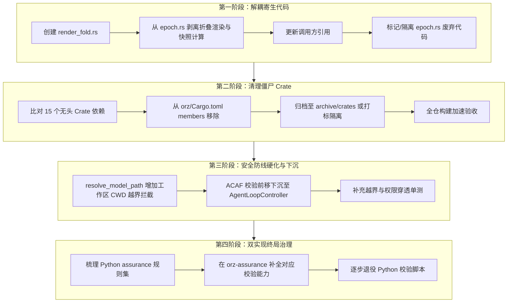

# ORZ / GSA 全仓深度架构审查报告（第二轮：深层结构性缺陷穿透）

> **审计日期**：2026-09-04  
> **审查性质**：在 Phase 1（门禁/编译阻断修复）、Phase 2（仓库卫生收敛）闭环后，对底座黑盒、寄生代码、双实现及安全边界展开的深层静态分析与源码穿透。  
> **审查状态**：`IN_PROGRESS / ACTION REQUIRED`（全仓 `cargo check --workspace` 虽 0 错误全绿，但存在严重的架构腐化、死代码寄生与双实现维护危机）。  
> **关联前序**：[`GLOBAL_ARCHITECTURE_AND_INTEGRITY_AUDIT_2026-09-04.md`](GLOBAL_ARCHITECTURE_AND_INTEGRITY_AUDIT_2026-09-04.md)  
>
> **状态更新（2026-09-04 收口）**：四阶段方案中任务 A（render_fold 解耦）、
> 任务 B（僵尸 crate 剔除 64→49）、任务 C（读工具 canonical 沙箱 +
> ACAF fail-closed 下沉）已闭合；任务 D（双实现终局治理）仍开放。闭合证据
> 与三轴复核见
> [`P0-GOV 收口审计`](P0_GOV_UNCOMMITTED_REVIEW_HANDLING_2026-09-04.md)。
> 原文为审查时快照，保留不删。

---

## 1. 阶段进展与当前防线状态

在首轮审查中暴露出的“门禁瘫痪、文件脏乱、相对死链”已通过前两阶段行动得到彻底遏制：

| 领域 | 治理前状态 | 治理后状态 | 验证手段 |
|---|---|---|---|
| **工程门禁** | Exit Code 1，62 处严重阻断 | **Exit Code 0，0 错误全绿** | `python scripts/check_repository.py` |
| **源码清单** | 7 个源文件未登记，50+ 文件 SHA 漂移 | **1434 个文件全量对齐** | `orz_source_manifest.sha256` |
| **测试夹具** | 3 个 run-event v0.2 payload 夹具断链 | **完全注册并映射** | `scripts/check_repository.py` |
| **文档链接** | 2 处相对路径深度嵌套 404 死链 | **完全修复为规范相对路径** | `check_repository.py` link-check |
| **仓库卫生** | 堆积 31 个 `tmp*` 临时垃圾目录及巨大回放日志 | **彻底清除，恢复干净工作树** | `git status -s` |
| **Git 忽略** | `_windows_high_nist/` 泛滥几十个测试日志 | **规范入 `.gitignore` 自动过滤** | `.gitignore` |
| **Rust 编译** | 存在 `dead_code` 与 `unused_assignments` 告警 | **全仓 64 个 workspace members 0 告警 0 错误** | `cargo check --workspace`（1m 38s） |
| **架构权威** | README / ADR-0010 仍写 120 轮与 epoch 轮换 | **对齐为“8 工具直调、会话黑板单实例、去自身硬超时”** | `README.md`, `ADR-0010`, `architecture/current/` |

**结论**：底层门禁防线与编译环境现已处于**绝对健康和受控状态**。我们具备了对手术刀级别的深层代码重构进行机械验收的坚实前提。

---

## 2. 四大深层结构性缺陷的客观实证

### 缺陷一：底座黑盒——15 个无头僵尸 Crate 寄生
在 `orz/Cargo.toml` 中，工作区成员（`workspace.members`）显式登记了多达 **64 个 Crate**。然而，通过 `cargo tree -p orz-bin` 进行全量依赖拓扑反查，**最终进入生产二进制（`orz-bin`）的仅有 49 个**。

整整 **15 个 Crate（外加测试工具库）在生产主线上完全未被引用**：
1. `crates/codegen/orz-chat-state`
2. `crates/codegen/orz-http`
3. `crates/codegen/orz-markdown`
4. `crates/codegen/orz-markdown-core`
5. `crates/codegen/orz-memory`
6. `crates/codegen/orz-models`
7. `crates/codegen/orz-shared`
8. `crates/codegen/orz-subagent-resolution`
9. `crates/codegen/ptyctl`
10. `crates/codegen/ptyctl-cli`
11. `crates/codegen/xai-agent-lifecycle`
12. `crates/codegen/xai-crash-handler`
13. `crates/codegen/xai-hooks-plugins-types`
14. `crates/codegen/xai-system-power`
15. `crates/codegen/xai-workflow`
*(其他未进入 bin 的辅助/孤立模块：`crates/orz-codex`、`crates/common/xai-test-utils`)*

**严重危害**：
- **资源浪费与构建拖累**：本地执行 `cargo check --workspace` 时，编译器被迫解析并构建这 15 个无头 crate 及其庞大的外部依赖树（例如 `ptyctl` 引入的终端底层库、`xai-workflow` 引入的状态机库），显著拖慢全仓构建速度。
- **审计认知污染**：外界或新参与者查阅工程时，会误以为系统拥有“复杂的子智能体调度器（subagent-resolution）”、“自动化工作流执行器（xai-workflow）”以及“多端内存管理（orz-memory）”，掩盖了当前系统“8 工具直接调用执行”的精炼事实。

---

### 缺陷二：撤回机制死代码滞留与“旧皮囊装新肉”
1. **`epoch.rs`（约 3300 行）的寄生扭曲**：
   - 生产语义上，`plan-epoch`（计划轮换周期与撤回机制）早在一周前的决策中被 §14.52 与单会话黑板架构正式取代（生产语义退役）。
   - 然而，在后续推进 P2-13/P2-14 黑板折叠渲染（Folded Rendering）与压缩快照时，开发人员未新建模块，而是**把活跃的生产折叠渲染（`render_exec_folded`、`render_edits_folded`）与会话黑板压缩快照直接寄生写在 `epoch.rs` 内部**！
   - **后果**：整个 `epoch.rs` 成了“旧皮囊装新肉”的怪胎。你不能简单删除它，因为生产链路必须调用其折叠渲染逻辑；但留着它，又伴生着数千行已废弃的 epoch 轮换死代码。
2. **`host_exec.rs`（约 7300 行）上帝文件未拆解**：
   - 工具执行分支、超时控制、取消注入、流式拼装、历史提交语义全部混在单一文件内，违反职责分离原则，变更风险极高。

---

### 缺陷三：双实现未砍——Python 握着最高法庭
尽管 2026-08-13 架构裁决明确要求“砍除双实现、降低复杂度”，但当前仓库仍存在两套平行宇宙：
- 根目录 `assurance/` 下存活着 **108 个 Python 文件、40 多个测试用例**！
- 核心包括 `assurance/run_event_journal_validation.py`（3,700 行）、`assurance/schema.py`、`assurance/windows_high_nist.py`。
- **事实权力分配**：真正的 schema 最终权威和 journal 校验法官，依然是 Python 这一侧；Rust 端虽然有 `orz-assurance`，但并未完全承接这套复杂的验证规则。
- **维护代价**：任何底层事件结构的变更（如这次 TER T0.2 引入 `run-event v0.2`），必须在 Python 端写一套验证逻辑，又在 Rust 端写一套。一旦两端校验口径漂移，就会引发隐蔽的生产或评测误判。

---

### 缺陷四：安全面三层虚标与穿透漏洞
1. **`read_file` 缺乏工作区沙箱限制（直接穿透 CWD）**：
   - 在 `orz-tools` 源码中：`resolve_model_path` 直接调用 `resolve_lexical` 解析绝对路径。只要模型输出 `d:/敏感目录/xxx` 或 `../../xxx`，引擎直接读取，根本没有做 `starts_with(&workspace_root)` 的硬阻断。
2. **ACAF 保护边界外露（未下沉 Controller）**：
   - ACAF fail-closed 强校验仅存在于 `orz-bin`（CLI 入口外壳）；在核心的 `AgentLoopController` 与底层循环中，没有强制的票据前置校验。如果未来通过 RPC、HTTP、IDE 插件或者内部 subagent 直接调用 Controller，底层执行循环将处于“完全无票放行”的裸奔状态。
3. **`web_search` 绕过权限桥**：
   - `web_search` 直接发起 HTTP 请求，完全不受工作区沙箱与文件审查拦截器的制约，缺乏统一的网络外发凭据校验通道。

---

## 3. 四阶段解耦与切除工程方案

### 第一阶段：解耦 `epoch.rs` 寄生代码与抽离独立渲染模块（立即推进）
1. **新建模块**：在 `orz/crates/orz-loop/src/` 创建 `render_fold.rs`。
2. **功能剥离**：将 `epoch.rs` 中的 `render_exec_folded`、`render_edits_folded` 以及会话黑板压缩快照计算函数完整迁移至 `render_fold.rs`。
3. **切断依赖**：更新 `agent.rs`、`controller.rs`、`blackboard.rs` 等模块的调用路径，指向新的 `render_fold.rs`。
4. **废弃隔离**：对 `epoch.rs` 中剩余的历史 plan-epoch 轮换逻辑明确标记 `#[deprecated]`，切断任何生产路径对它的调用。

### 第二阶段：清理 15 个无头僵尸 Crate
1. 在 `orz/Cargo.toml` 中，将未被 `orz-bin` 依赖的 15 个 Crate 从 `workspace.members` 中剔除。
2. 确保 `cargo check -p orz-bin` 及全工作区检查依然完全通过，验证无隐式编译断裂。

### 第三阶段：路径沙箱收敛与 ACAF 下沉
1. 修改 `orz-tools` 的 `resolve_model_path`，强制加入 `target_path.starts_with(&workspace_root)` 的硬阻断检查，对于越界读取直接返回权限拒绝。
2. 将 ACAF 票据校验从 CLI 壳层进一步下沉至 `AgentLoopController` 的每轮工具分发点，实现全链路 fail-closed。

### 第四阶段：双实现清算
1. 全面梳理 Python `assurance/run_event_journal_validation.py` 与 Rust `orz-assurance` 的差异。
2. 在 Rust 侧补齐缺失的断言逻辑，彻底解除对外部 Python 法官的单点依赖。
